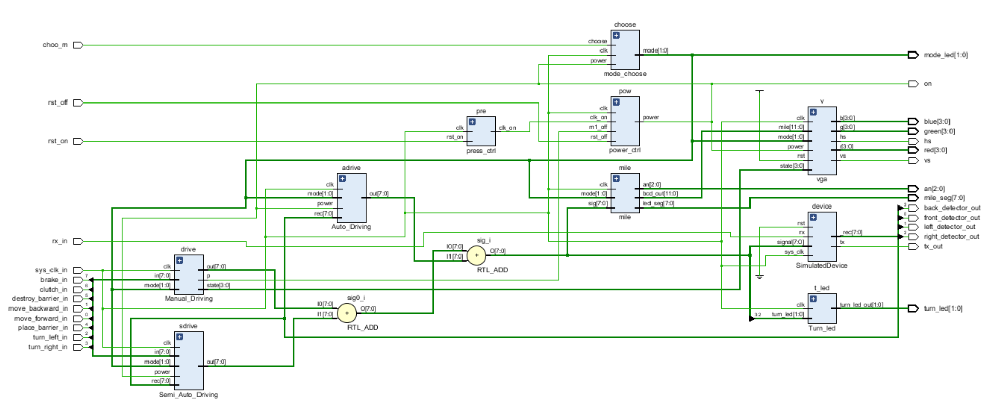

## SUSTech_CS207-DD_2022f_Project-a-real-car

#### 小组成员：徐春晖，郭健阳

------

### 开发计划 & 工程总览

#### 1. 小组选题： a real car

#### 2. 成员分工及贡献百分比 (平均分配)

- 徐春晖：顶层模块构建与全局控制实现，手动模式实现，led 灯管里程显示，VGA 显示。
- 郭健阳：手动模式构建与实现，半自动模式构建与实现，自动模式构建与实现。

贡献百分比**相同，均为 50% **。

#### 3. 进度安排

1. 项目需求分析与代码初步构建 22/12/01~12/09
2. 项目代码搭建，在中期答辩前完成 50% 功能 12/10~12/15
3. 项目代码完善，包括 Bonus 除自动模式外其余功能完成 12/16~12/31
4. 报告撰写及整体功能完善 23/01/01~

#### 4. 执行记录

- 22/12/01 确认选题为 a real car
- 12/09 第一次讨论，确认中期答辩需要完成的内容
- 12/13 开始完整分析项目，简单制作状态图
- 12/14 完成初步完成顶层模块构建与开关控制
- 12/15 完成全局控制 (20%)，手动模式 (50%) 除转向外的全部内容，录制并提交中期答辩视频
- 12/24 项目 ddl 延迟，组员陆续患新冠肺炎，决定暂缓项目
- 12/25 手动模式 (50%) 转向灯完成
- 12/26 半自动模式 (30%) 完成
- 12/27 VGA 显示整体构建完成
- 12/28 自动模式初步构建
- 12/31 VGA 显示 (+20%) 对接完成。至此，除了完整的自动模式，其余全部功能完成，开始撰写报告。
- To be continue...

#### 心得：

由于人手相对较少，且成员各科任务繁重，小组在中期答辩前几天采用了高效率沟通工作的模式，先提前完成其他各科任务，再空出接近整整两天的完整时间，一口气让项目代码由 0 到 1 完成构建，并实现了 50% 的基础功能。中期答辩后采用分组工作，两位分别对各自负责的功能逐步完善。

本次 Project 让小组成员加深了对硬件项目的构建和 HDL 各种特性的理解，之前 Lab 课上的诸多没有注意到的知识细节和盲区，也在项目中暴露出来，解决问题并加深了理解。更重要的是，简单积累了项目的规划与设计经验，在以后的项目开发中想必能更顺心。

------

### 项目设计

#### 1. 需求分析

- **系统功能：**

  本项目实现了一个由  EGO1 控制的小车的驾驶的逻辑。通过使用 SA 提供的模拟小车运行的迷宫程序与预先留下的 Verilog 发信模块，完成小车的运行模拟、寻路模拟。

  预留有启动控制模块，分别控制小车的电源开、关与模式选择。有手动模式有油门、挂档、换挡、刹车与转向功能及控制，半自动模式有前进与转向的控制，及胡同自动转向和路口等待指令的功能，自动模式应有自动寻至出口的功能。

  显示模块包括七段数码显示管实现的里程显示，及 VGA 的小车状态及里程显示。

- **各个端口的功能说明**

  

- **顶层端口规格：**

  | 引脚  | 规格          | 名称                 | 功能                |
  | ----- | ------------- | -------------------- | ------------------- |
  | P17   | `input`       | `sys_clk_in`         | 系统时钟            |
  | N5    | `input`       | `rx_in`              | 通信模块输入 信号   |
  | P4    | `output`      | `tx_out`             | 通信模块输出 信号   |
  | U4    | `input`       | `rst_on`             | 复位 信号           |
  | V1    | `input`       | `turn_left_in`       | 左转 按钮           |
  | R11   | `input`       | `turn_right_in`      | 右转 按钮           |
  | P4    | `input`       | `move_forward_in`    | 油门 开关           |
  | P5    | `input`       | `move_backward_in`   | 倒挡 开关           |
  | R2    | `input`       | `place_barrier_in`   | 放置信标 信号       |
  | M4    | `input`       | `destroy_barrier_in` | 摧毁信标 信号       |
  | N4    | `input`       | `clutch_in`          | 离合 开关           |
  | R1    | `input`       | `brake_in`           | 刹车 开关           |
  | H4    | `output`      | `front_detector_out` | 前障碍探测 灯       |
  | J2    | `output`      | `left_detector_out`  | 左障碍探测 灯       |
  | J3    | `output`      | `right_detector_out` | 右障碍探测 灯       |
  | K2    | `output`      | `back_detector_out`  | 后障碍探测 灯       |
  | R1    | `input`       | `choo_m`             | 模式选择 按钮       |
  | R17   | `input`       | `rst_off`            | 全局关闭 按钮       |
  | K1    | `output`      | `on`                 | 全局电源 灯         |
  | OMTD  | `output[7:0]` | `mile_seg`           | 数码管七段显示 信号 |
  | OMTD  | `output[2:0]` | `an`                 | 数码管选择 信号     |
  | M1,K3 | `output[1:0]` | `mode_led`           | 模式指示 灯         |
  | G4,F6 | `output[1:0]` | `turn_led`           | 转向 灯             |
  | OMTD  | `output[3:0]` | `red`                | VGA 红 信号         |
  | OMTD  | `output[3:0]` | `green`              | VGA 绿 信号         |
  | OMTD  | `output[3:0]` | `blue`               | VGA 蓝 信号         |
  | OMTD  | `output`      | `hs`                 | VGA 水平同步 信号   |
  | OMTD  | `output`      | `vs`                 | VGA 垂直同步 信号   |

#### 2. 主要模块设计

- #####  [**Global_top**](..\sources\Global_top.v)

  

- [**power_ctrl**](..\sources\control\power_ctrl.v)

  

  | 端口名称  | 功用描述                       |
  | --------- | ------------------------------ |
  | `clk`     | 系统时钟                       |
  | `clk_on`  | 高电平则激活启动               |
  | `m1_off`  | 手动模式可能造成的断电信号输入 |
  | `rst_off` | 关闭按钮的信号                 |
  | `power`   | 控制电源的开关                 |

- [**press_ctrl**](..\sources\control\press_ctrl.v)

  

  | 端口名称 | 功用描述                                         |
  | -------- | ------------------------------------------------ |
  | `clk`    | 系统时钟                                         |
  | `rst_on` | 开启电源按钮输入，内有计数器                     |
  | `clk_on` | 计数器计够 1s 时变为高电平，传给`power_ctrl`模块 |

-  [**mode_choose**](..\sources\control\mode_choose.v) 

  

  | 端口名称 | 功用描述                                        |
  | -------- | ----------------------------------------------- |
  | `choose` | 切换模式按钮输入，内有计数器，0.5s 变化一次模式 |
  | `clk`    | 系统时钟                                        |
  | `power`  | 电源状态输入，断电时模块不可用                  |
  | `mode`   | 模式输出，对应三种模式                          |

-  [**Manual_Driving**](..\sources\module\Manual_Driving.v) 

  

  | 端口名称 | 功用描述                                         |
  | -------- | ------------------------------------------------ |
  | `clk`    | 系统时钟                                         |
  | `in`     | 手动模式下各种操作的信号输入                     |
  | `mode`   | 模式状态输入，`2'b01` 时模块可用                 |
  | `out`    | 操作信号输出，对应原始的 `uart_top` 8 位输入信号 |
  | `p`      | 可能的错误操作的断电信号输出                     |
  | `state`  | 状态机状态输出，用于 VGA 显示                    |

-  [**Turn_led**](..\sources\view\Turn_led.v) 

  

  | 端口名称       | 功用描述                                          |
  | -------------- | ------------------------------------------------- |
  | `clk`          | 系统时钟                                          |
  | `turn_led`     | 根据 `uart_top`接收到的原始的左右转信号作信号输入 |
  | `turn_led_out` | 两位左右转向灯信号输出                            |

-  [**mile**](..\sources\view\mile.v) 

  

  | 端口名称  | 功用描述                                                     |
  | --------- | ------------------------------------------------------------ |
  | `clk`     | 系统时钟                                                     |
  | `mode`    | 模式状态输入，`2'b01` 时模块可用                             |
  | `sig`     | 原始的 `uart_top` 8 位输入信号作为输入，模块内实现计数器以模拟里程 |
  | `an`      | 七段数码显示管的的选择信号                                   |
  | `bcd`     | 里程的 3 位 BCD 码、共计12 位宽的输出，用于 VGA 显示         |
  | `led_seg` | 七段数码显示管的 8 位显示信号                                |

-  [**Semi_Auto_Driving**](..\sources\module\Semi_Auto_Driving.v) 

  

  | 端口名称 | 功用描述                                         |
  | -------- | ------------------------------------------------ |
  | `clk`    | 系统时钟                                         |
  | `in`     | 半自动模式下各种操作的信号输入                   |
  | `mode`   | 模式状态输入，`2'b10` 时模块可用                 |
  | `power`  | 电源状态输入                                     |
  | `rec`    | 各个方向探测信号的输入                           |
  | `out`    | 操作信号输出，对应原始的 `uart_top` 8 位输入信号 |

- [**Auto_Driving**](..\sources\module\Auto_Driving.v) 

  

  | 端口名称 | 功用描述                                         |
  | -------- | ------------------------------------------------ |
  | `clk`    | 系统时钟                                         |
  | `mode`   | 模式状态输入，`2'b11` 时模块可用                 |
  | `power`  | 电源状态输入                                     |
  | `rec`    | 各个方向探测信号的输入                           |
  | `out`    | 操作信号输出，对应原始的 `uart_top` 8 位输入信号 |
  
- [**vga**](..\sources\view\vga.v) 

  

  | 端口名称 | 功用描述                            |
  | -------- | ----------------------------------- |
  | `clk`    | 系统时钟                            |
  | `mile`   | `mile`模块输出的里程 12 位宽 BCD 码 |
  | `mode`   | 模式状态输入                        |
  | `power`  | 电源状态输入                        |
  | `rst`    | 复位信号输入                        |
  | `state`  | 手动模式下状态机状态输入            |
  | `b`      | 蓝色信号输出                        |
  | `g`      | 绿色信号输出                        |
  | `hs`     | 水平同步信号输出                    |
  | `r`      | 红色信号输出                        |
  | `vs`     | 垂直同步信号输出                    |

------

### 总结 & 优化

#### 1. 遇到的一些问题与解决方案

- 七段数码显示管显示数字重叠

  解决方案：由数码管选择信号变化频率过快导致，将其由系统时钟分频为周期为 2ms 的时钟后解决

- 手动模式的状态存在大量重合情况，感觉无从下手

  解决方案：细分每一种情况，设计更多状态的状态机

#### 2. 一些可行的优化

- 顶层模块构建较为混乱，仍然存在一些不必要的 `wire` 与 `reg` 
- 个别模块冗余，如 `press_ctrl` 可以合并到 `power_ctrl` ，达成后者的内部计数功能
- 个别模块内部单独对相同频率的时钟重复分频，可以在顶层模块中统一进行一次分频后再根据需要传给各个二级模块
- 代码风格不够统一，工程前期对于一些端口或参数的命名稍显随意，可读性稍弱

