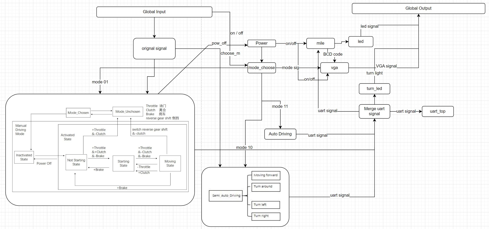
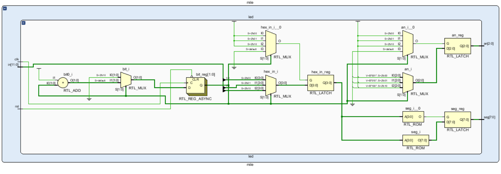
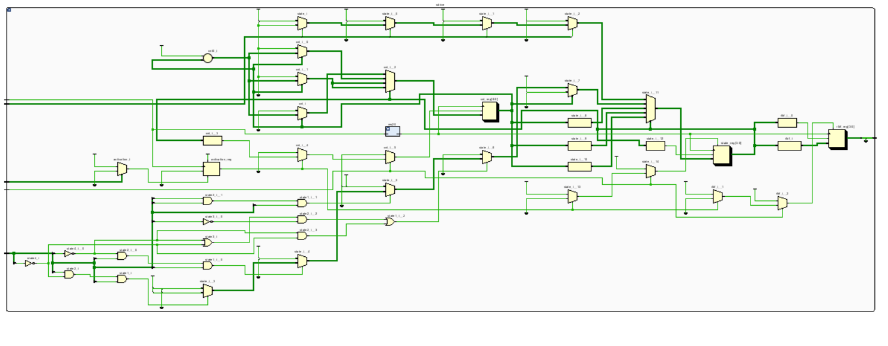

## SUSTech_CS207-DD_2022f_Project-a-real-car

#### 小组成员：徐春晖，郭健阳

> 源码托管于 GitHub，将在项目 ddl 结束后基于 **MIT License** 协议开源，访问链接：
>
> https://github.com/OctCarp/SUSTech_CS207-DD_2022f_Project-a-real-car

------

### 开发计划 & 工程总览

#### 1. 小组选题： a real car

#### 2. 成员分工及贡献百分比 (平均分配)

- 徐春晖：顶层模块构建与全局控制实现，手动模式实现，led 灯管里程显示，VGA 显示。报告整体撰写。
- 郭健阳：手动模式构建与实现，半自动模式构建与实现，自动模式构建与实现。视频整体制作。

贡献百分比**相同，均为 50%**。

#### 3. 进度安排

1. 项目需求分析与代码初步构建 22/12/01~12/09
2. 项目代码搭建，在中期答辩前完成 50% 功能 12/10~12/15
3. 项目代码完善，包括 Bonus 除自动模式外其余功能完成 12/16~12/31
4. 完成包括 Bonus 在内的所有得分点，报告撰写及整体功能完善 23/01/01~01/02

#### 4. 执行记录

- 22/12/01 确认选题为 a real car。
- 12/09 第一次讨论，确认中期答辩需要完成的内容。
- 12/13 开始完整分析项目，简单制作状态图。
- 12/14 完成初步完成顶层模块构建与开关控制。
- 12/15 完成全局控制 (20%)，手动模式 (50%) 除转向外的全部内容，录制并提交中期答辩视频。
- 12/24 项目 ddl 延迟，组员陆续患新冠肺炎，决定暂缓项目。
- 12/25 手动模式 (50%) 转向灯完成。
- 12/26 半自动模式 (30%) 完成。
- 12/27 VGA 显示整体构建完成。
- 12/28 自动模式初步构建。
- 12/31 VGA 显示 (+20%) 对接完成。至此，除了完整的自动模式，其余全部功能完成，开始撰写报告。
- 23/01/02 完成自动模式 (+20%)。至此，包括 Bonus 在内的所有要求功能完成，项目答辩视频制作完成。

#### 心得：

由于人手相对较少，且成员各科任务繁重，小组在中期答辩前几天采用了高效率沟通工作的模式，先提前完成其他各科任务，再空出接近整整两天的完整时间，一口气让项目代码由 0 到 1 完成构建，并实现了 50% 的基础功能。中期答辩后采用分组工作，两位分别对各自负责的功能逐步完善。

本次 Project 让小组成员加深了对硬件项目的构建和 HDL 各种特性的理解，之前 Lab 课上的诸多没有注意到的知识细节和盲区，也在项目中暴露出来，解决问题并加深了理解。更重要的是，简单积累了项目的规划与设计经验，在以后的项目开发中想必能更顺心。

------

### 使用说明

#### 1. 系统功能：

本项目实现了一个由  EGO1 控制的小车的驾驶的逻辑。通过使用 SA 提供的模拟小车运行的迷宫程序与预先留下的 Verilog 发信模块，完成小车的运行模拟、寻路模拟。

预留有启动控制模块，分别控制小车的电源开、关与模式选择。有手动模式有油门、挂档、换挡、刹车与转向功能及控制，半自动模式有前进、掉头与转向的控制，及胡同自动掉头和岔路口等待指令的功能，自动模式有一键自动寻至出口的功能。

显示模块包括七段数码显示管实现的里程显示，及 VGA 的小车状态及里程显示。

#### 2. 各个开关的功能说明：

- `on`：电源启动按钮，按住 **1s** 打开引擎
- `off`：电源关闭按钮
- `switch mode`：模式切换按钮，按住 **0.5s** 切换模式
- `turn left`：左转控制按钮
- `turn right`：右转控制按钮
- `throttle`：油门开关
- `reverse`：倒挡开关
- `clutch`：离合开关
- `brake`：刹车开关，且覆盖油门
- `power`：电源指示灯
- `mode`：模式指示灯
- `turn light`：转向灯
- `detector`：探测灯
- `mile display`：里程显示器

#### 3. 顶层端口规格及功能：

  | 引脚  | 规格          | 名称                 | 功能                |
  | ----- | ------------- | -------------------- | ------------------- |
  | P17   | `input`       | `sys_clk_in`         | 系统时钟            |
  | N5    | `input`       | `rx_in`              | 通信模块输入 信号   |
  | P4    | `output`      | `tx_out`             | 通信模块输出 信号   |
  | U4    | `input`       | `rst_on`             | 复位 信号           |
  | V1    | `input`       | `turn_left_in`       | 左转 按钮           |
  | R11   | `input`       | `turn_right_in`      | 右转 按钮           |
  | P4    | `input`       | `move_forward_in`    | 油门 开关           |
  | P5    | `input`       | `move_backward_in`   | 倒挡 开关           |
  | R2    | `input`       | `place_barrier_in`   | 放置信标 信号       |
  | M4    | `input`       | `destroy_barrier_in` | 摧毁信标 信号       |
  | N4    | `input`       | `clutch_in`          | 离合 开关           |
  | R1    | `input`       | `brake_in`           | 刹车 开关           |
  | H4    | `output`      | `front_detector_out` | 前障碍探测 灯       |
  | J2    | `output`      | `left_detector_out`  | 左障碍探测 灯       |
  | J3    | `output`      | `right_detector_out` | 右障碍探测 灯       |
  | K2    | `output`      | `back_detector_out`  | 后障碍探测 灯       |
  | R1    | `input`       | `choo_m`             | 模式选择 按钮       |
  | R17   | `input`       | `rst_off`            | 全局关闭 按钮       |
  | K1    | `output`      | `on`                 | 全局电源 灯         |
  | OMTD  | `output[7:0]` | `mile_seg`           | 数码管七段显示 信号 |
  | OMTD  | `output[2:0]` | `an`                 | 数码管选择 信号     |
  | M1,K3 | `output[1:0]` | `mode_led`           | 模式指示 灯         |
  | G4,F6 | `output[1:0]` | `turn_led`           | 转向 灯             |
  | OMTD  | `output[3:0]` | `red`                | VGA 红 信号         |
  | OMTD  | `output[3:0]` | `green`              | VGA 绿 信号         |
  | OMTD  | `output[3:0]` | `blue`               | VGA 蓝 信号         |
  | OMTD  | `output`      | `hs`                 | VGA 水平同步 信号   |
  | OMTD  | `output`      | `vs`                 | VGA 垂直同步 信号   |

#### 4. 使用指南

- **电源开关：**
  
  - **打开：** 按住电源启动键 **1s** 后打开电源。
  - **关闭：** 按下电源关闭键关闭电源。
- **模式选择：**
- **模式切换：** 在电源启动状态下按住模式选择键，每按住 **0.5s** 切换一次模式。模式灯 `01` 对应手动，`10` 对应半自动，`11` 对应自动。
- **手动模式：**
  - **点火：** 在手动模式下，默认为**未点火**状态。先打开离合，再打开油门点火。此时关闭离合即发动完毕，并前进。（**注意：**未点火时，不打开离合直接踩油门，将造成**电源关闭**）
  - **前进：** 点火后，未挂倒挡时，打开油门，汽车将前进；关闭油门，汽车将停下。
  - **转向：** 点火后，按住左或右转向按钮时，小车转向，对应的转向灯闪烁。（同时按下时，小车将直行）
  - **刹车：** 打开刹车时，小车停下，**回到未点火状态**。且刹车开关覆盖油门，即刹车开启时油门操作无效。
  - **倒挡：** 点火后，打开离合后可切换倒挡，关闭离合后结束切换。若倒挡挂上，则打开油门汽车倒退。（**注意：**若切换时离合没有打开，将造成**电源关闭**）
- **半自动模式：**

  - **行进逻辑：** 离开起点且未遇到岔路口时，小车将自动寻路，在检测到死胡同后调转 180° 后前进。小车遇到只能左转或者只能右转的情况也会自动左转并前进或右转并前进。
  - **前进指令：** 遇到岔路口时，推动油门开关一次，小车将前进。
  - **倒转指令：** 遇到岔路口时，推动倒挡开关一次，小车将调转 180° 后前进。
  - **左转指令：** 遇到岔路口时，按下左转按钮，小车将 90° 左转。
  - **右转指令：** 遇到岔路口时，按下右转按钮，小车将 90° 右转。
- **自动模式：**
  - **行进逻辑：** 切换到自动模式时，开始依右转优先原则寻至终点（保证小车由起点出发），如果不能右转则直行优先，最后再左转，死胡同则掉头。下车前方的探测器探测到墙体或信标后会进入一个静止的判断状态（起始时也是该状态），此时直行优先（只对起始时有效，因为运动后只有前方无路才进入该静止判断状态），然后优先右转，右转不行再优先左转，最后掉头。每次右转后前进一格放置一个信标，每次掉头时摧毁一个信标。

- **里程计数：**
  - **计数逻辑：** 前进每 1s 计 2m，倒退计 1m。

- **VGA 显示：**
  - **显示内容：** 电源开关状态，模式状态，及手动模式的各种各种状态，里程显示。

------

### 项目设计

#### 1. 顶层模块状态流程图

#### 2. 主要模块设计

- #####  [**Global_top**](../sources/Global_top.v)

  

  内部实现：

  - `press_ctrl` 按压计数模块，接受原始的开启按钮信号，内部计数到 1s 后把启动信号传给开关控制模块
  - `power_strl` 开关控制模块，接受原始的关闭按钮信号，按压计数模块的启动信号，以及手动模式模块传来的熄火信号，决定开关。
  - `mode_choose` 开关影响模式选择模块，内部有计数器，按下每 0.5s 切换一次模式，输出模式信号。各个行进模式模块同时接收模式信号，并决定自己模块是否工作。
  - `Manual_Driving` `Semi_Auto_Driving` `Auto_Driving` 各个模式模块根据模式信号来决定是否启用，启用后，根据各自的行进逻辑和状态，处理各种开关按钮的输入信号，并转化为传给 UART 模块的输出信号。其中手动模式模块还会输出给开关控制模块熄火信号。
  - `SimulatedDevice` 项目 Demo 中包含的 UART 通信相关模块，负责接受传给小车运行程序的信号。
  - `Turn_led` 转向灯模块通过分析传给 UART 相关模块的左转右转信号，来点亮左转右转灯。
  - `mile` 里程模块通过分析传给 UART 相关模块的前进后退信号，进行计数，并在内部实现了 8 位 2 进制码转 12位宽的 BCD 码，并可输出给 VGA 显示和 led 显示端口，分 3 位显示对应里程。
  - `led` led 模块为里程模块的子模块，通过接收里程模块 12 位宽的 BCD 信号，实现了七段数码显示管的输出信号和数码管选择信号，显示三位十进制数字。
  - `vga` VGA 模块接收模式信号和里程 12 位 BCD 信号，并在内部转化为字阵的选择信号给字阵储存模块，接收储存模块的输出，存在 VGA 模块中，并在 VGA 信号扫描到对应亮起的像素点时输出 RGB 全 1 信号（白色）。
  - `char_set` 字阵储存模块，内部储存了了包含边缘在内的 8 行 7 列的多个字阵，每个字用 6 位宽的选择信号在 26 个字母和、9 个数字以及一些符号中，选择输出一个字阵。

- [**power_ctrl**](../sources/control/power_ctrl.v)

  

  | 端口名称  | 功用描述                       |
  | --------- | ------------------------------ |
  | `clk`     | 系统时钟                       |
  | `clk_on`  | 高电平则激活启动               |
  | `m1_off`  | 手动模式可能造成的断电信号输入 |
  | `rst_off` | 关闭按钮的信号                 |
  | `power`   | 控制电源的开关                 |
  
  

- [**press_ctrl**](../sources/control/press_ctrl.v)

  

  | 端口名称 | 功用描述                                         |
  | -------- | ------------------------------------------------ |
  | `clk`    | 系统时钟                                         |
  | `rst_on` | 开启电源按钮输入，内有计数器                     |
  | `clk_on` | 计数器计够 1s 时变为高电平，传给`power_ctrl`模块 |
  
  

- [**mode_choose**](../sources/control/mode_choose.v) 

  

  | 端口名称 | 功用描述                                        |
  | -------- | ----------------------------------------------- |
  | `choose` | 切换模式按钮输入，内有计数器，0.5s 变化一次模式 |
  | `clk`    | 系统时钟                                        |
  | `power`  | 电源状态输入，断电时模块不可用                  |
  | `mode`   | 模式输出，对应三种模式                          |
  
  

- [**Manual_Driving**](../sources/mode/Manual_Driving.v) 

  

  | 端口名称 | 功用描述                                         |
  | -------- | ------------------------------------------------ |
  | `clk`    | 系统时钟                                         |
  | `in`     | 手动模式下各种操作的信号输入                     |
  | `mode`   | 模式状态输入，`2'b01` 时模块可用                 |
  | `out`    | 操作信号输出，对应原始的 `uart_top` 8 位输入信号 |
  | `p`      | 可能的错误操作的断电信号输出                     |
  | `state`  | 状态机状态输出，用于 VGA 显示                    |
  
  

- [**Turn_led**](../sources/view/Turn_led.v) 

  

  | 端口名称       | 功用描述                                          |
  | -------------- | ------------------------------------------------- |
  | `clk`          | 系统时钟                                          |
  | `turn_led`     | 根据 `uart_top`接收到的原始的左右转信号作信号输入 |
  | `turn_led_out` | 两位左右转向灯信号输出                            |
  
  

- [**mile**](../sources/view/mile.v) 

  

  | 端口名称  | 功用描述                                                     |
  | --------- | ------------------------------------------------------------ |
  | `clk`     | 系统时钟                                                     |
  | `mode`    | 模式状态输入，`2'b01` 时模块可用                             |
  | `sig`     | 原始的 `uart_top` 8 位输入信号作为输入，模块内实现计数器以模拟里程 |
  | `an`      | 七段数码显示管的的 3 位选择信号                              |
  | `bcd`     | 里程的 3 位 BCD 码、共计12 位宽的输出，用于 VGA 显示         |
  | `led_seg` | 七段数码显示管的 8 位显示信号                                |
  
  

- [**led**](../sources/view/led.v) 

  

  | 端口名称 | 功用描述                                                     |
  | -------- | ------------------------------------------------------------ |
  | `clk`    | 系统时钟                                                     |
  | `in`     | 里程的 3 位 BCD 码、共计12 位宽的输入，用于七段数码显示管显示 |
  | `rst`    | 复位信号                                                     |
  | `an`     | 七段数码显示管的的 3 位选择信号，输出给 `mile` 模块          |
  | `seg`    | 七段数码显示管的 8 位显示信号，输出给 `mile` 模块            |
  
  

- [**Semi_Auto_Driving**](../sources/mode/Semi_Auto_Driving.v) 

  

  | 端口名称 | 功用描述                                         |
  | -------- | ------------------------------------------------ |
  | `clk`    | 系统时钟                                         |
  | `in`     | 半自动模式下各种操作的信号输入                   |
  | `mode`   | 模式状态输入，`2'b10` 时模块可用                 |
  | `power`  | 电源状态输入                                     |
  | `rec`    | 各个方向探测信号的输入                           |
  | `out`    | 操作信号输出，对应原始的 `uart_top` 8 位输入信号 |
  
  

- [**Auto_Driving**](../sources/mode/Auto_Driving.v) 

  
  
  | 端口名称 | 功用描述                                         |
  | -------- | ------------------------------------------------ |
  | `clk`    | 系统时钟                                         |
  | `mode`   | 模式状态输入，`2'b11` 时模块可用                 |
  | `power`  | 电源状态输入                                     |
  | `rec`    | 各个方向探测信号的输入                           |
  | `out`    | 操作信号输出，对应原始的 `uart_top` 8 位输入信号 |
  
  
  
- [**vga**](../sources/view/vga.v) 

  
  
  | 端口名称 | 功用描述                            |
  | -------- | ----------------------------------- |
  | `clk`    | 系统时钟                            |
  | `mile`   | `mile`模块输出的里程 12 位宽 BCD 码 |
  | `mode`   | 模式状态输入                        |
  | `power`  | 电源状态输入                        |
  | `rst`    | 复位信号输入                        |
  | `state`  | 手动模式下状态机状态输入            |
  | `b`      | 蓝色信号输出                        |
  | `g`      | 绿色信号输出                        |
  | `hs`     | 水平同步信号输出                    |
  | `r`      | 红色信号输出                        |
  | `vs`     | 垂直同步信号输出                    |
  
  

- [**char_set**](../sources/view/char_set.v) （参考自互联网）

  
  
  | 端口名称   | 功用描述                                                     |
  | ---------- | ------------------------------------------------------------ |
  | `clk`      | 系统时钟                                                     |
  | `data`     | 6 位宽选择信号，用于在 26 个字母和、9 个数字以及一些符号中，决定使用哪个字阵 |
  | `rst`      | 复位信号                                                     |
  | `col(1-6)` | 字阵储存信号，输出包含边缘在内的 8 行 7 列的字阵             |
  
  

------

### 总结 & 优化

#### 1. 遇到的一些问题与解决方案

- 徐：

  - 七段数码显示管显示数字重叠

    解决方案：由数码管选择信号变化频率过快导致，由于选择信号频率变化过快，数码管无法快速反映出选择信号的变化，所以同时显示三个数字的七段数码信号。将其由系统时钟分频为周期为 2ms 的时钟后解决。

  - 手动模式的状态存在大量重合情况，感觉无从下手

    解决方案：细分每一种情况，尤其是对未点火状态的各个可能操作添加对应的跳转逻辑，来确保点火逻辑正常进行。设计更多状态的状态机，仔细检查状态跳转的组合逻辑。
    
  - VGA 模式要显示变化的字块，不知如何变化
  
    解决方案：设计一个单独的模块，根据顶层模块传进来的状态信号、里程信号来转化为字阵模块的选择信号，模块化功能。

- 郭：
  - 半自动驾驶时遇到路口后，左右转或者掉头之后需要直行一小段距离离开路口（否则调整车头方向之后仍在路口）再进行接下来运动的判断，而直行时间难以精准控制，导致接下来的运动撞墙。
  
    解决方案：大量尝试不断修改完善，使参数更精确。
  
  - 自动驾驶过程中参数难以精确控制，导致时间上的偏差，最后撞墙。
  
    解决方案：增加一个静止状态，每当小车前方的探测器探测到墙体或者信标为高电平的时候，切换到该静止状态，在静止状态中再进行判断接下来的运动，避免了撞墙。
  
  - 自动驾驶时使用右转优先原则遇到回路会循环。
  
    解决方案：右转后向前走一个放置一个信标，当小车遇到死胡同（即小车前方、左方、右方均有墙体或信标时，摧毁信标一次并掉头）。
  
  - `Global` 调用三种模式时三种模式各自的最终输出信号均绑定到 `sig` 信号，出现 multiple driver 的情况。
  
    解决方案：分别写三个信号 `sig1`、`sig2`、`sig3`，绑定到三个模式的输出信号上，然后将 `sig` 信号赋值为`sig=sig1+sig2+sig3`（不同的 `mode` 信号导致最多一种模式运作，其它模式返回的信号均为 0，故可以将三个信号对应位置上的信号分别加起来的方式赋给最终的 `sig` 信号）。

#### 2. 一些可行的优化

- 徐：

  - 顶层模块构建较为混乱，仍然存在一些不必要的 `wire` 与 `reg` 。
  - 个别模块冗余，如 `press_ctrl` 可以合并到 `power_ctrl` ，达成后者的内部计数功能。
  - 个别模块内部单独对相同频率的时钟重复分频，可以在顶层模块中统一进行一次分频后再根据需要传给各个二级模块。
  - 代码风格不够统一，工程前期对于一些端口或参数的命名稍显随意，可读性稍弱。
  - 本次项目中 VGA 模块不用彩色输出，所以没必要分别输出各 4 位的 RGB 信号，可以整合为一个 12 位信号。

- 郭：
  - 全自动驾驶时，特别情况下，如果遇到右转后进入一个要不断右转的回路，且转向间隙较短（没有足够的处理信标的机会），则小车可能会被永远困在回路中。
  - 全自动驾驶时小车前方遇到墙或信标时，以及小车右转然后直行一格后放置信标会停下来一小段时间，整体运行的流畅性还可以提高。

------

### 项目报告到此结束，感谢您的阅读！
